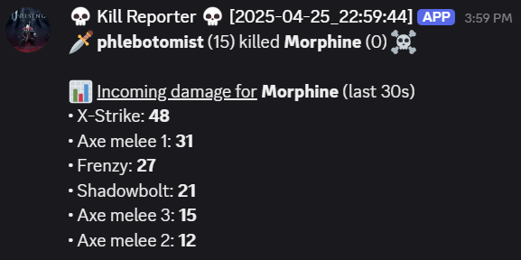
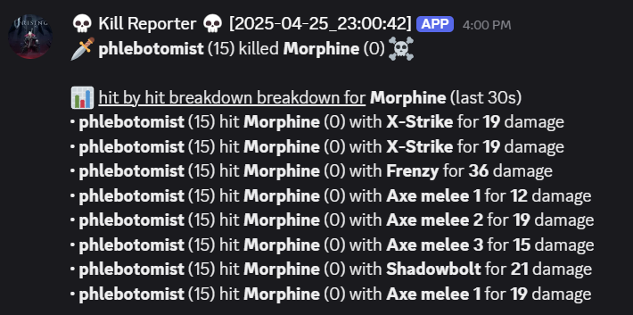

# PvPDetails

The mod is still in development! Testing is hard for me because it requires multiple players to pvp. If you experience errors in logs please send them to me on discord or post them in issues on github.

If you have time to help me test shoot me a message on discord (@morphine) I will likely need help just involves you smacking me in game a lot.

## install

Requires: [VampireWebhook](https://github.com/phlebotomist/VampireWebhook) and [VampireDB](https://github.com/phlebotomist/VampireDB) (yes both dlls in vampireDB)

## commands

```ini
Commands:
    - .pvpme
    - .pvptop [category]

Current category options are [damage, kills, assists]
```

## Settings:

Right now there's only one but there will be many toggles later.

```ini
## The level of detail you want to show in the combat report sent to discord.
## can be set to 1,2 or 3 (see example images of each level below)
# Default value: 2
CombatBreakdownDetail = 2
```

## Webhook CombatBreakdownDetail examples:

### Detail level 1:


### Detail level 2:



### Detail level 3:



## Setting up webhook:

follow instructions here: [VampireWebhook](https://github.com/phlebotomist/VampireWebhook)

# thanks to everyone on the Vrising mod discord!

Deca, Odjit Helskog, Mitch and others who answered my endless coffee fueled questions.
