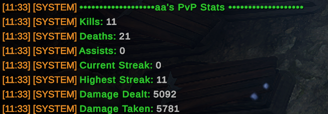

# PvPDetails - player stats, killfeed, death recap!

More features to come!
Please don't hesitate to give feedback I'm all ears. @ me on Vrising mod discord @morphine or dm me.

## install

Requires: [VampireWebhook](https://github.com/phlebotomist/VampireWebhook) and [VampireDB](https://github.com/phlebotomist/VampireDB) (yes both dlls in vampireDB)

That means you should have `PvPDetails.dll`, `VampireDB.dll`, `lightdb.dll` and `VampireWebHook.dll` all in your plugins folder.

Optional:

- Set up the hook.txt for [VampireWebhook](https://github.com/phlebotomist/VampireWebhook) to get death recaps

## commands

```ini
Commands:
    - .pvpme
    - .pvptop [category]

Current category options are [damage, kills, assists]
```

`.pvpme`:  


`.pvptop damage`:  


KillFeed example:  


## Settings:

Right now there's only one but there will be many toggles later.

```ini
## The level of detail you want to show in the combat report sent to discord.
## can be set to 1,2 or 3 (see example images of each level below)
# Default value: 2
CombatBreakdownDetail = 2
```

## Webhook CombatBreakdownDetail examples:

### Detail level 1:


### Detail level 2:


### Detail level 3:


## Setting up webhook:

follow instructions here: [VampireWebhook](https://github.com/phlebotomist/VampireWebhook)

# thanks to everyone on the Vrising mod discord!

Deca, Odjit, Helskog, Mitch and others who answered my endless coffee fueled questions.
