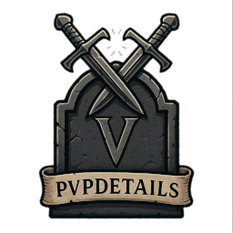
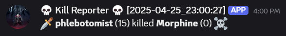

# PvPDetails - player stats, killfeed, death recap!

More features to come!
Please don't hesitate to give feedback I'm all ears. @Morphine on the Vrising modding [Discord](https://vrisingmods.com/discord).

## install

Download all dependencies and put them next to eachother in the plugins folder.

To setup death recaps add your webhook url to `hook.txt`. More instructions [here](https://github.com/phlebotomist/VampireWebhook).

## commands

```ini
Commands:
    - .pvpme
    - .pvptop [category]

Current category options are [damage, kills, assists]
```

`.pvpme`:  


`.pvptop damage`:  


KillFeed example:  


## Settings:

Right now there's only one but there will be many toggles later.

```ini
## The level of detail you want to show in the combat report sent to discord.
## can be set to 1,2 or 3 (see example images of each level below)
# Default value: 2
CombatBreakdownDetail = 2
```

## Webhook CombatBreakdownDetail examples:

### Detail level 1:



### Detail level 2:


### Detail level 3:


## Setting up webhook:

follow instructions here: [VampireWebhook](https://github.com/phlebotomist/VampireWebhook)

# thanks to everyone on the Vrising mod discord!

Deca, Odjit, Helskog, Mitch and others who answered my endless coffee fueled questions.

## known issues:

Some weapon/ability names in damage recap may show up as numbers (weapon ID) instead of the name.
